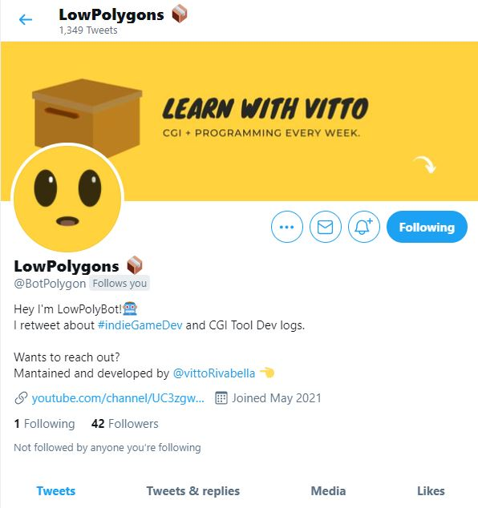

 


<!-- PROJECT LOGO -->
<br />
<p align="center">
  <a href="https://github.com/Eversmile12/LowPoly-Bot">
    🐦
  </a>

  <h3 align="center">LowPoly Bot</h3>

  <p align="center">
    Simple Twitter Bot made using Python and Tweepy
    <br />
    <a href="https://twitter.com/BotPolygon">View Demo</a>
    ·
    <a href="https://github.com/Eversmile12/LowPoly-Bot/issues">Report Bug</a>
    ·
    <a href="https://github.com/Eversmile12/LowPoly-Bot/issues ">Request Feature</a>
  </p>
</p>


<!-- TABLE OF CONTENTS -->
<details open="open">
  <summary><h2 style="display: inline-block">Table of Contents</h2></summary>
  <ol>
    <li>
      <a href="#about-the-project">About The Project</a>
      <ul>
        <li><a href="#built-with">Built With</a></li>
      </ul>
    </li>
    <li>
      <a href="#getting-started">Getting Started</a>
      <ul>
        <li><a href="#installation">Installation</a></li>
      </ul>
    </li>
    <li><a href="#usage">Usage</a></li>
    <li><a href="#license">License</a></li>
    <li><a href="#contact">Contact</a></li>
    <li><a href="#acknowledgements">Acknowledgements</a></li>
  </ol>
</details>


<!-- ABOUT THE PROJECT -->
## About The Project
LowPoly Bot is a simple Twitter bot created to test bots on twitter and to promote my YouTube Channel.




### Built With

* [Tweepy](https://www.tweepy.org/)
* [Python](https://www.python.org/)
* [Heroku](https://www.heroku.com/)


<!-- GETTING STARTED -->
## Getting Started

To get a local copy up and running follow these simple steps.

### Installation

1. Clone the repo
   ```sh
   git clone https://github.com/Eversmile12/LowPoly-Bot.git
   ```
2. Install requirements:
   ```sh
   pip install -r requirements.txt
   ```
3. Create a new twitter account and request your [Developer Credentials](https://developer.twitter.com/en)

Here you can find a full walkthrough:

- [How to create your own Twitter bot](https://binaryroot.xyz/post.php?post_id=170)

- [Host your Twitter bot to Heroku](https://binaryroot.xyz/post.php?post_id=177)


<!-- USAGE EXAMPLES -->
## Usage

If you want to run the Twitter bot locally you'll need to replace the API Access keys into the code base, currently handled via environ, with your own API Keys obtainable via the Twitter Developer Portal.

Once substituted, you'll be able to run the Twitter bot simply writing:
   ```sh
   py lowpoly_bot.py
   ```


_For more examples, please refer to the [Tutorial](https://binaryroot.xyz/post.php?post_id=170)_


<!-- LICENSE -->
## License

Distributed under the MIT License. See `LICENSE` for more information.


<!-- CONTACT -->
## Contact

Your Name - [@VittoRivabella](https://twitter.com/@VittoRivabella) - iwasvitto@gmail.com

Project Link: [https://github.com/Eversmile12/LowPoly-Bot](https://github.com/Eversmile12/LowPoly-Bot)


<!-- ACKNOWLEDGEMENTS -->
## Acknowledgements
A special thanks goes to
* [Adriaan Van Niekerk - Deploying on Heroku](https://www.youtube.com/channel/UC62YcVWO968SSeAM1YK_C-w)
* [CSDOJO - Developing a Twitter Bot](https://www.youtube.com/watch?v=W0wWwglE1Vc)


<!-- MARKDOWN LINKS & IMAGES -->
<!-- https://www.markdownguide.org/basic-syntax/#reference-style-links -->
[screenshot-url]: lowpolybot.JPG
[contributors-shield]: https://img.shields.io/github/contributors/Eversmile12/repo.svg?style=for-the-badge
[contributors-url]: https://github.com/Eversmile12/LowPoly-Bot/graphs/contributors
[forks-shield]: https://img.shields.io/github/forks/Eversmile12/repo.svg?style=for-the-badge
[forks-url]: https://github.com/Eversmile12/LowPoly-Bot/network/members
[stars-shield]: https://img.shields.io/github/stars/Eversmile12/repo.svg?style=for-the-badge
[stars-url]: https://github.com/Eversmile12/LowPoly-Bot/stargazers
[issues-shield]: https://img.shields.io/github/issues/Eversmile12/repo.svg?style=for-the-badge
[issues-url]: https://github.com/Eversmile12/LowPoly-Bot/issues
[license-shield]: https://img.shields.io/github/license/Eversmile12/repo.svg?style=for-the-badge
[license-url]: https://github.com/Eversmile12/LowPoly-Bot/blob/master/LICENSE.txt
[linkedin-shield]: https://img.shields.io/badge/-LinkedIn-black.svg?style=for-the-badge&logo=linkedin&colorB=555
[linkedin-url]: https://www.linkedin.com/in/vittorio-rivabella/